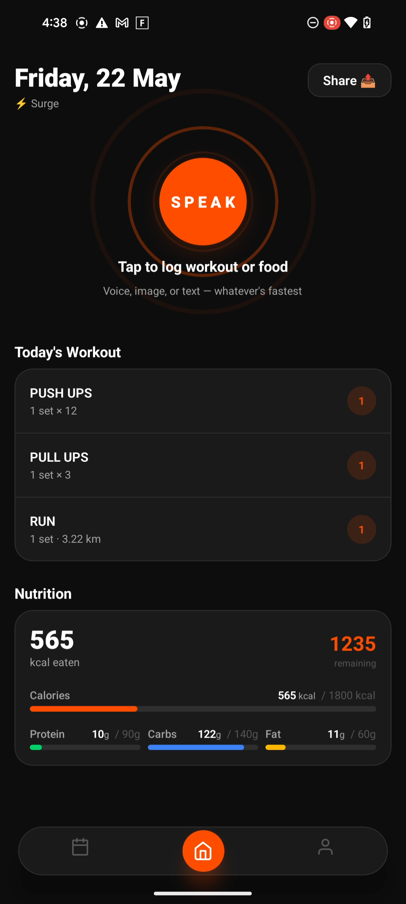
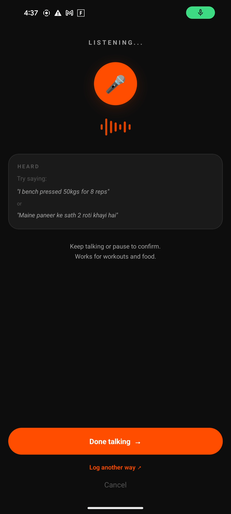
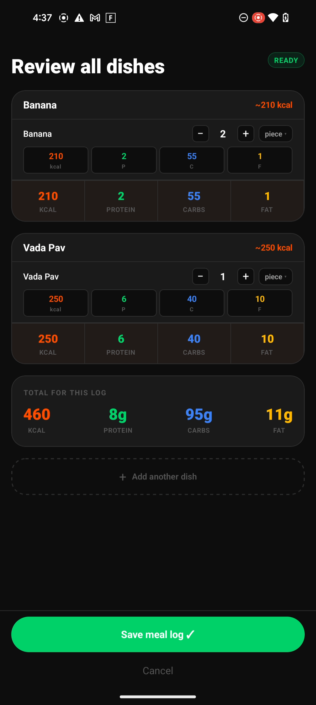
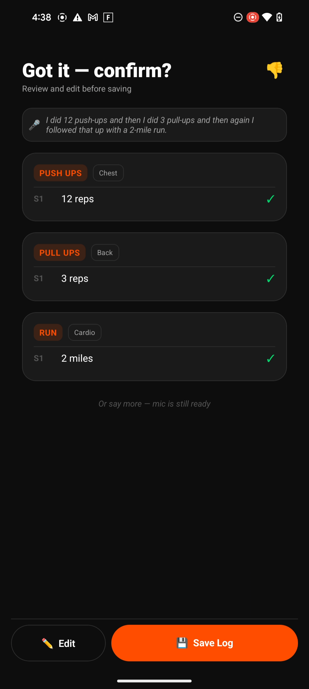
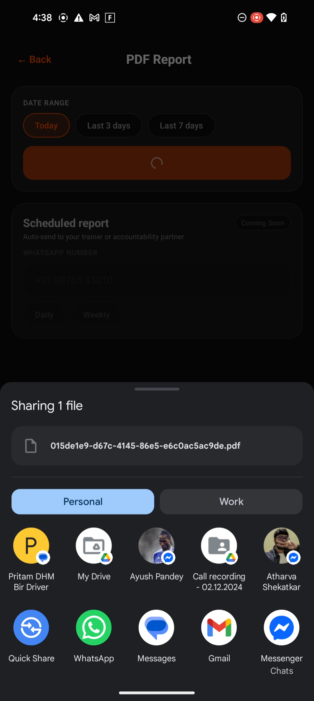
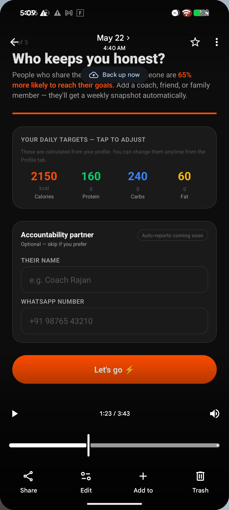
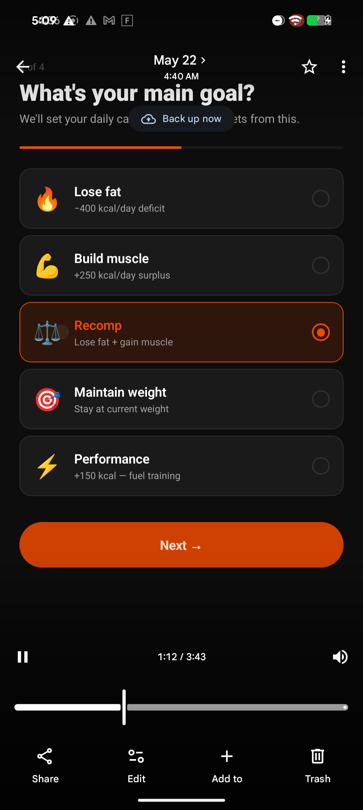
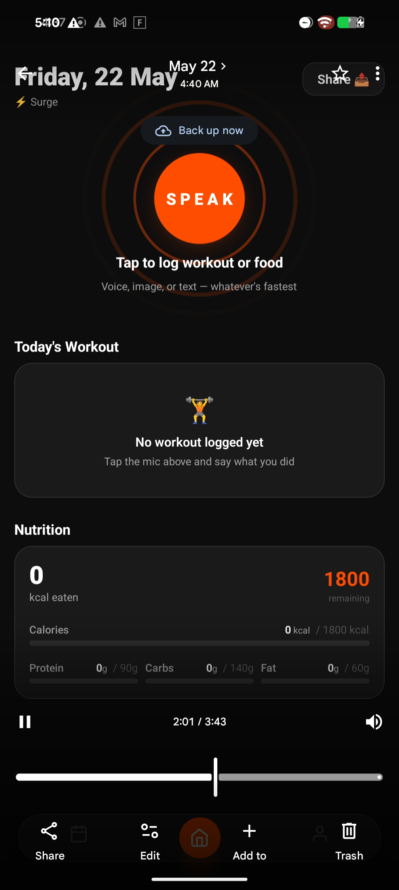

# Surge — Workout & Diet Log

**One app for gym tracking and nutrition logging. Voice-first, AI-powered.**

Surge lets you log workouts and food by just speaking. Say _"bench press 80kg, 5 sets of 8"_ or _"had 2 rotis and dal for lunch"_ — Surge parses it, confirms it, and tracks your macros and progress automatically.

[](https://expo.dev/accounts/shivam1504mistry/projects/surge/builds/9a380b54-5b17-4cbb-a92e-cb16650ed81a)

---

## Screenshots

<p align="center">
  
  
  
  
</p>
<p align="center">
  
  
  
  
</p>

---

## Features

**Voice Logging**
- Log workouts and food by speaking naturally in English or Hindi/Hinglish
- AI transcribes (Whisper) and parses (GPT-4o-mini) into structured data
- Supports exercises, sets, reps, weight, cardio, and food with macros

**Gym Tracking**
- Exercises, sets, reps, weight — logged by voice or tap
- Bodyweight, weighted, and cardio exercise support
- Personal records detected automatically
- Supports kg and lbs

**Nutrition Tracking**
- Voice, photo (AI), barcode scan, or manual search (Open Food Facts)
- AI breaks dishes into ingredients with per-ingredient macros
- Indian food supported — rotis, katori dal, vada pav, etc.
- Daily calorie, protein, carbs, fat totals vs targets

**Today Dashboard**
- Single screen showing workout + nutrition together
- Macro progress rings and bars
- Floating tab bar with quick voice access

**History & Reports**
- Calendar view with color-coded dots
- PDF reports shareable via WhatsApp, email
- Scheduled auto-reports to your trainer/coach

---

## Tech Stack

| Layer | Technology |
|-------|-----------|
| **Framework** | React Native (Expo SDK 55) |
| **Navigation** | Expo Router (file-based) |
| **State** | Zustand |
| **Backend** | Supabase (Postgres + Auth + Edge Functions + RLS) |
| **Auth** | Phone OTP + Google OAuth via Supabase |
| **AI - Voice** | OpenAI Whisper (transcription) + GPT-4o-mini (parsing) |
| **AI - Image** | GPT-4o Vision for food photo macro estimation |
| **Food DB** | Open Food Facts API |
| **PDF** | expo-print (HTML-to-PDF) |
| **Analytics** | PostHog |
| **Build** | EAS Build + EAS Submit |
| **Languages** | TypeScript |

---

## Architecture

```
app/                    # Expo Router screens (file-based routing)
  (tabs)/               # Tab screens — Today, History, Profile
  onboarding/           # Onboarding flow (phone → goals → experience → food units)
components/             # Reusable UI — VoiceModal, FoodConfirmModal, etc.
hooks/                  # Custom hooks — useVoiceLog, etc.
stores/                 # Zustand stores — nutritionStore, etc.
lib/                    # Utilities — supabase client, analytics, report generation
constants/              # Theme tokens (colors, spacing, fonts)
supabase/
  functions/            # Edge Functions — parse-voice, parse-food-image, schedule-reports
  schema.sql            # Database schema
  migrations/           # SQL migrations
```

---

## Getting Started

### Prerequisites
- Node.js 18+
- Expo CLI (`npm install -g expo-cli`)
- EAS CLI (`npm install -g eas-cli`)
- Supabase project (free tier works)
- OpenAI API key (for voice/image AI features)

### Setup

```bash
# Clone the repo
git clone https://github.com/shivam1504mistry/surge.git
cd surge

# Install dependencies
npm install

# Set up environment variables
cp .env.example .env
# Fill in your Supabase URL, anon key in .env

# Start the dev server
npx expo start
```

### Supabase Setup
1. Create a Supabase project
2. Run `supabase/schema.sql` in the SQL editor to create tables
3. Enable Phone auth provider
4. Deploy edge functions: `supabase functions deploy parse-voice` (requires OpenAI API key as a secret)

### Building

```bash
# Android preview APK
npx eas build --platform android --profile preview

# Android production AAB (for Play Store)
npx eas build --platform android --profile production

# iOS (via Xcode)
npx expo prebuild --platform ios
open ios/surge.xcworkspace
```

---

## Status

- Android: Closed testing on Google Play Store
- iOS: Development builds via Xcode
- Play Store listing: [Surge — Workout & Diet Log](https://play.google.com/store/apps/details?id=com.shivammistry.surge) (coming soon)

---

## License

This project is source-available for portfolio and review purposes. Not licensed for redistribution or commercial use.

---

Built by [Shivam Mistry](https://github.com/shivam1504mistry)
